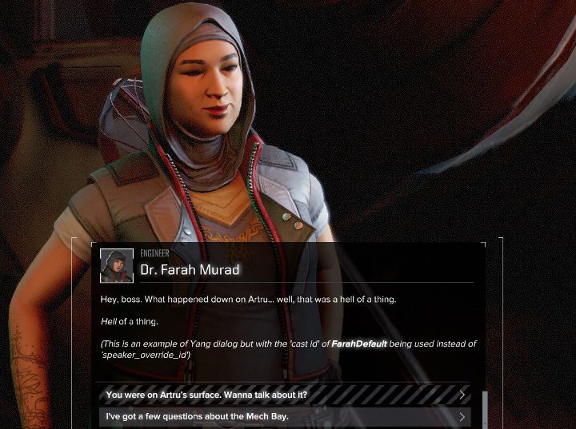

# ConverseTek

Conversation editor for HBS's [Battletech](http://battletechgame.com/).

Battletech uses a binary data format for its conversations. It isn't possible to edit those files directly so this tool is being developed to allow for editing and creating new conversations.

## Overview

Latest release: **v1.0.0** | [Download](https://github.com/CWolfs/ConverseTek/releases/tag/v1.0.0)

## Examples

### Screenshots

* [Editor View](https://raw.githubusercontent.com/CWolfs/ConverseTek/develop/docs/images/0.4.0/conversetek-example.png)
* [In-Game Edited Conversation](https://raw.githubusercontent.com/CWolfs/ConverseTek/develop/docs/images/conversetek-example.png)

### Videos

* [Conversation with Yang](https://www.youtube.com/watch?v=JcjByWyr1lM)
* [Copy & Links Functionality](https://www.youtube.com/watch?v=P9sbtz019ws)
* [Drag Rearrange Functionality](https://www.youtube.com/watch?v=9Y4xSxJRO_s)

## Installation Instructions

* Download and install [.NET 4.72 Runtime](https://www.microsoft.com/net/download/thank-you/net472)
* Download the [latest release](https://github.com/CWolfs/ConverseTek/releases/) and unzip it
* Copy `ShadowrunDTO.dll` and `ShadowrunSerializer.dll` from your `BATTLETECH/BattleTech_Data/Managed` directory into the `ConverseTek` application folder
* Run `ConverseTek.exe` from the `ConverseTek` application folder

## FAQ

Some questions are answered in the [FAQ section](https://github.com/CWolfs/ConverseTek/blob/master/docs/faq.md).

## Feedback

All feedback is welcome in the [issues section](https://github.com/CWolfs/ConverseTek/issues).

## Roadmap

| Feature | Expected Version | Status  |
| ------- | ---------------- | ------- |
| Directory selection | 0.1.0 | :heavy_check_mark: |
| Conversation - Loading | 0.1.0 | :heavy_check_mark: |
| Conversation - Edit id | 0.1.0 | :heavy_check_mark: |
| Conversation - Edit name | 0.1.0 | :heavy_check_mark: |
| Conversation - Edit dialog text | 0.1.0 | :heavy_check_mark: |
| Conversation - Save | 0.1.0 | :heavy_check_mark: |
| Conversation - Edit node id | 0.2.0 | :heavy_check_mark: |
| Conversation - Id regeneration | 0.2.0 | :heavy_check_mark: |
| Conversation - Save as... | 0.2.0 | :heavy_check_mark: |
| Conversation - New | 0.2.0 | :heavy_check_mark: |
| Conversation - Edit dialog node speaker by speaker id | 0.2.0 | :heavy_check_mark: |
| Conversation - Edit dialog node speaker by cast id | 0.2.0 | :heavy_check_mark: |
| Conversation - Add/Edit comments | 0.2.0 | :heavy_check_mark: |
| Conversation - Delete node | 0.3.0 | :heavy_check_mark: |
| Conversation - Add node | 0.3.0 | :heavy_check_mark: |
| Conversation - Node toggle 'Only Available Once' | 0.3.0 | :heavy_check_mark: |
| Conversation - Drag node rearrange | 0.4.0 | :heavy_check_mark: |
| Conversation - Linking | 0.4.0 | :heavy_check_mark: |
| Conversation - Visual indicators - Actions | 1.0.0 | :heavy_check_mark: |
| Conversation - Visual indicators - Conditions | 1.0.0 | :heavy_check_mark: |
| Conversation - Add conditions | 1.0.0 | :heavy_check_mark: |
| Conversation - Remove conditions | 1.0.0 | :heavy_check_mark: |
| Conversation - Edit conditions | 1.0.0 | :heavy_check_mark: |
| Conversation - Add actions | 1.0.0 | :soon: |
| Conversation - Remove actions | 1.0.0 | :soon: |
| Conversation - Edit actions | 1.0.0 | :soon: |
| Conversation - Search | TBD | :heavy_minus_sign: |

## Author

Richard Griffiths (CWolf)
  * [Twitter](https://twitter.com/CWolf)
  * [LinkedIn](https://www.linkedin.com/in/richard-griffiths-436b7a19/)