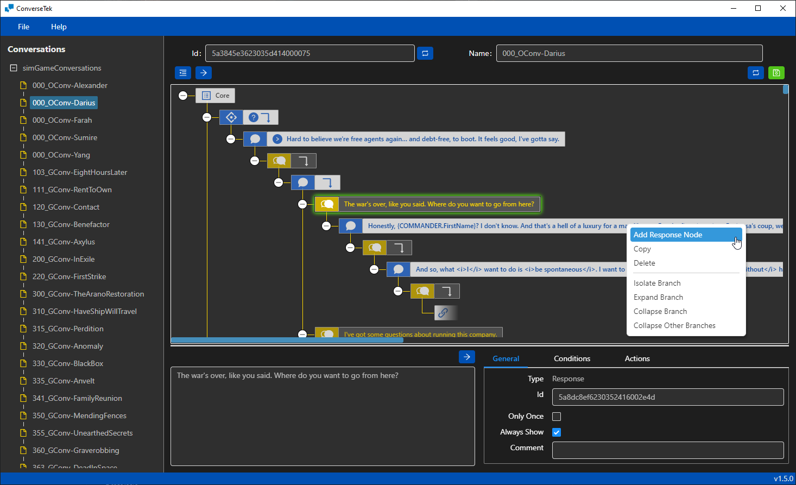

# ConverseTek

Conversation editor for HBS's [Battletech](http://battletechgame.com/).

Battletech uses a binary data format for its conversations. It isn't possible to edit those files directly so this tool is being developed to allow for editing and creating new conversations.

## Overview

Latest release: **v1.6.0** | [Download](https://github.com/CWolfs/ConverseTek/releases/tag/v1.6.0)

### Complimentary Mods

- `ExtendedConversations` mod | Adds more dialog tags, actions, conditions and features | [Docs](https://github.com/CWolfs/ExtendedConversations) | [Download](https://github.com/CWolfs/ExtendedConversations/releases/)

### Videos

- [v1.5 - Walkthrough](https://www.youtube.com/watch?v=GFBJt1Cjpwk)
- [v1.5 - Isolate Branch](https://raw.githubusercontent.com/CWolfs/ConverseTek/develop/docs/images/1.5.0/conversetek-isolate-branch.gif)
- [v1.4 - Zooming](https://raw.githubusercontent.com/CWolfs/ConverseTek/develop/docs/images/1.4.0/conversetek-zoom-feature.gif)
- [v1.4 - Improved Folder Navgation](https://raw.githubusercontent.com/CWolfs/ConverseTek/develop/docs/images/1.4.0/conversetek-improved-folder-navigation.gif)
- [v1.4 - Improved Layout](https://raw.githubusercontent.com/CWolfs/ConverseTek/develop/docs/images/1.4.0/conversetek-drag-expand.gif)
- [Conversation with Yang](https://www.youtube.com/watch?v=JcjByWyr1lM)
- [Copy & Links Functionality](https://www.youtube.com/watch?v=P9sbtz019ws)
- [Drag Rearrange Functionality](https://www.youtube.com/watch?v=9Y4xSxJRO_s)
- [Time Skip Action](https://www.youtube.com/watch?v=Y7Wzd2NElTE) ([**Requires ExtendedConversations**](https://github.com/CWolfs/ExtendedConversations))
- [Set Current System Action](https://www.youtube.com/watch?v=3za9qaGPwO4) ([**Requires ExtendedConversations**](https://github.com/CWolfs/ExtendedConversations))

## Installation Instructions

- Download and install [.NET framework](https://dotnet.microsoft.com/en-us/download/dotnet-framework) (no earlier than [.NET 4.72 Runtime](https://www.microsoft.com/net/download/thank-you/net472))
- Download the [latest release](https://github.com/CWolfs/ConverseTek/releases/) and unzip it
- Copy `ShadowrunDTO.dll` and `ShadowrunSerializer.dll` from your `BATTLETECH/BattleTech_Data/Managed` directory into the `ConverseTek` application folder
- Run `ConverseTek.exe` from the `ConverseTek` application folder

## FAQ

Some questions are answered in the [FAQ section](https://github.com/CWolfs/ConverseTek/blob/master/docs/faq.md).

## Feedback

All feedback is welcome in the [issues section](https://github.com/CWolfs/ConverseTek/issues).

## Contributors

MalD - Feature suggestions & testing

## Features

- Load and Save sim game conversations
  - One-on-one conversations
  - Group conversations
- Edit existing dialog
- Create new conversations
- Add actions and conditions to dialog nodes
- Link dialog nodes for conversations that loop back on themselves
- Flexible support for future conditions, actions and value getters
  - JSON definition extension support
- Full support for `ExtendedConversations` mod
- Flashpoint compatibility

## Dialog Tags

BattleTech uses dialog tags which are replaced at runtime with the appropriate text. To access it use the following in your dialog text.

### Tooltips

Square brackets will show a short yellow hover-over enabled tooltip. Once mouse overed, the tooltip will display the full text. In this case the full tooltip text is taken from the base descriptions definition file. It checks the `DataManager` and allows you to select information. For example,

- `[[DM.BaseDescriptionDefs[LoreThomasCalderon],Protector Calderon's]]`
- `[[DM.Factions[faction_MagistracyOfCanopus],Canopian]]`
- `[[DM.CastDefs[...and so on`

### Replacements

Curly braces enable reflection on the game object registered to the handler. You can access the game variables and properties with this approach. For example,

- `{COMPANY.DaysPassed}` - Gets how many days have passed since the start of the game
- `{COMMANDER.FirstName}` - Gets the commander's first name
- `{TGT_SYSTEM.Habitable}` - Checks if the current star system is habitable

## Author

Richard Griffiths (CWolf)

- [Twitter](https://twitter.com/CWolf)
- [LinkedIn](https://www.linkedin.com/in/richard-griffiths-436b7a19/)
