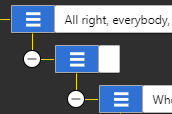

# Frequently Asked Questions - ConverseTek v0.1.0

## Conversation Editor

### "What's the purpose of this tool?"

It's a Battletech sim (non-combat) conversation editor.

Battletech uses a binary data format for its conversations. It isn't possible to edit those files directly so this tool is being developed to allow for editing and creating new conversations.

### "What can the tool do exactly?"

Check out the [Roadmap](https://github.com/CWolfs/ConverseTek/#roadmap) for a full feature list.

### "Is ConverseTek compatible with [ModTek](https://github.com/Mpstark/ModTek)?"

Yes. Conversation files created or edited with ConverseTek work with [ModTek](https://github.com/Mpstark/ModTek) since the conversation files are loaded from the manifest file.

### "Why does my new dialog not work? I've copyed it from an existing one."

Conversation files use unique ids for the conversation itself, and all dialog nodes. Since _v0.1.0_ does not officially support creating entirely new conversations yet
there might be a clash with the conversation ids (_idRefs_). Check the [Roadmap](https://github.com/CWolfs/ConverseTek/#roadmap) to see the supported features per version.

### "What does an empty dialog node mean?"

An empty node is not actually empty, it just has no dialog text associated with it. Battletech uses these mainly as conditional check points, or gateways to larger
branches of dialog. ConverseTek _v0.1.0_ does not support editing **actions** or **conditions**. In later versions you'll be able to select any node
and add/remove actions and conditions.

Action and condition icons will be added to the dialog nodes to better indicate which nodes have actions and dialogs.

### "I can drag dialog nodes around but it doesn't seem to do anything at all. When I save and load the conversation everything is reset!"

Dragging dialog nodes around isn't supported in _v0.1.0_. I left in the UI functionality as it'll be a feature **_ComingSoon(tm)_**.

### "What is an action?"

An **action** is what Battletech uses to trigger something from a dialog node. These may be playing music, with `Play BattleTech Audio Event` for example, or triggering a
game screen fade with `Set BattleTech Fade`.

### "What is a condition?"

A **condition** is what Battletech uses to control which dialog branches to display to the player, and which ones to hide. It can check against various things like
your player's history so, for instance, if you selected your back story to include having an accident when you were young you'd check against `commander_youth_accident`. It can also check against game milestone tags like `oc04_post_argo`.